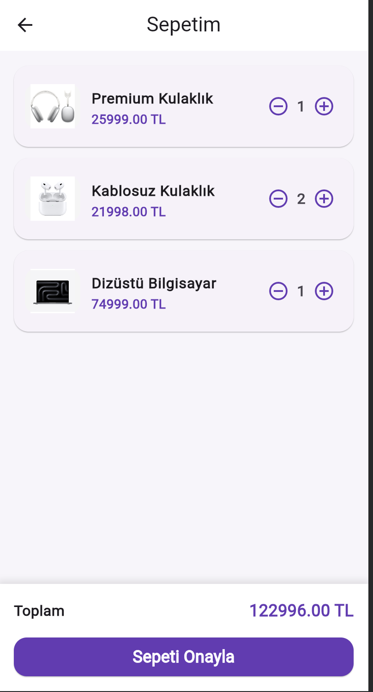

# Mini Katalog Uygulaması

Flutter ile geliştirilmiş basit bir mobil katalog uygulamasıdır. Uygulamada ürünler listelenebilir, ürün detayları görüntülenebilir ve seçilen ürünler sepete eklenebilir.

## Özellikler

* Ürün listeleme
* Ürün arama
* Ürün detay sayfası
* Sepet ekranı
* Sepette ürün adedi artırma ve azaltma
* Toplam sepet tutarını hesaplama
* GridView ile ürün kartları
* Navigator ile sayfalar arası geçiş
* JSON dosyasından ürün verisi okuma

### Kullanılan Teknolojiler

- Flutter 3.44.2
- Dart 3.12.2
- Material Design

## Proje Yapısı

```text
lib/
├── main.dart
├── models/
│   └── product.dart
└── screens/
    ├── home_screen.dart
    ├── product_detail_screen.dart
    └── cart_screen.dart

assets/
└── data/
    └── products.json

screenshots/
├── home.png
├── detail.png
└── cart.png
```

## Kurulum ve Çalıştırma

Projeyi çalıştırmak için terminalde aşağıdaki komutlar kullanılabilir:

```bash
flutter pub get
flutter run
```


Web üzerinde çalıştırmak için:

```bash
flutter run -d chrome
```


## Ekran Görüntüleri

### Ana Sayfa


### Ürün Detay


### Sepet


## Geliştirici

Yasin Doğru
